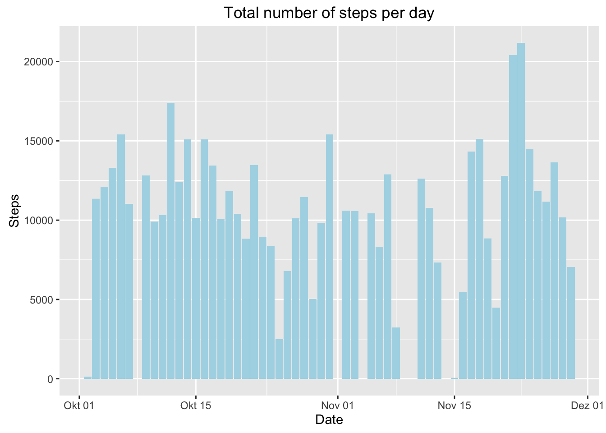
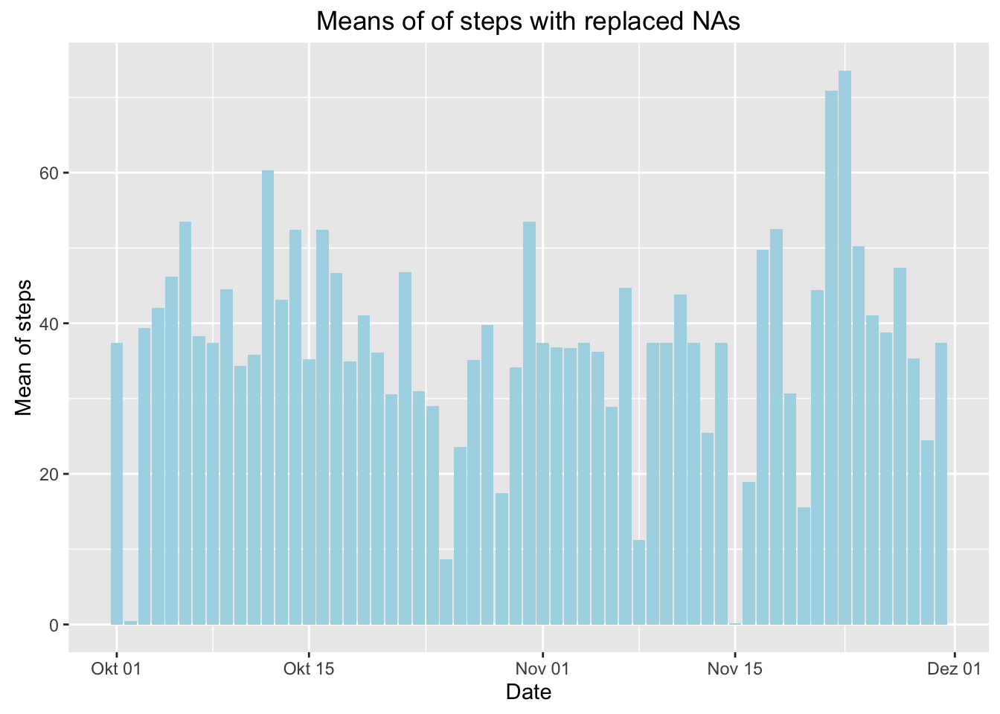
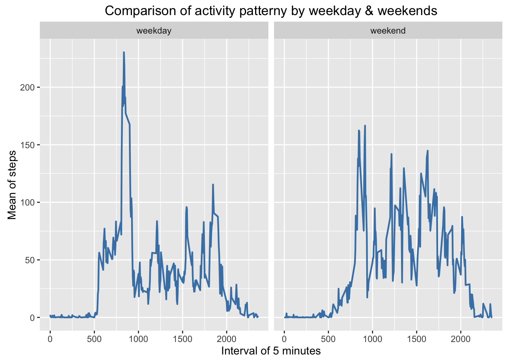

# Reproducible Research: Peer Assessment 1


## Loading and preprocessing the data


```r
# load packages
library(magrittr)
library(dplyr)
```

```
## 
## Attaching package: 'dplyr'
```

```
## Die folgenden Objekte sind maskiert von 'package:stats':
## 
##     filter, lag
```

```
## Die folgenden Objekte sind maskiert von 'package:base':
## 
##     intersect, setdiff, setequal, union
```

```r
library(ggplot2)

# set wd
setwd("/Users/majideismann/Documents/Coursera/05_Reproducable Research/week1/programmingAssignment/")

# import data
data <- read.csv("activity.csv")
data$date <- as.POSIXct(data$date, format = "%Y-%m-%d")

head(data)
```

```
##   steps       date interval
## 1    NA 2012-10-01        0
## 2    NA 2012-10-01        5
## 3    NA 2012-10-01       10
## 4    NA 2012-10-01       15
## 5    NA 2012-10-01       20
## 6    NA 2012-10-01       25
```



## What is mean total number of steps taken per day?

```r
# plot total
ggplot(aes(date, steps), data = data) +
geom_bar(stat = "identity", fill = "lightblue") + 
labs(title = "Total number of steps per day") + 
ylab("Steps") + 
xlab("Date") 
```

```
## Warning: Removed 2304 rows containing missing values (position_stack).
```

```r
# summarise means
data %>% 
  na.omit() %>% 
  group_by(date) %>% 
  summarize(
    mean = mean(steps, na.rm = TRUE), 
    median = median(steps, na.rm = TRUE)
  )
```

```
## Source: local data frame [53 x 3]
## 
##          date     mean median
##        (time)    (dbl)  (dbl)
## 1  2012-10-02  0.43750      0
## 2  2012-10-03 39.41667      0
## 3  2012-10-04 42.06944      0
## 4  2012-10-05 46.15972      0
## 5  2012-10-06 53.54167      0
## 6  2012-10-07 38.24653      0
## 7  2012-10-09 44.48264      0
## 8  2012-10-10 34.37500      0
## 9  2012-10-11 35.77778      0
## 10 2012-10-12 60.35417      0
## ..        ...      ...    ...
```

## What is the average daily activity pattern?

```r
# summarise mean per interval
data %>% 
na.omit() %>% 
  group_by(interval) %>% 
  summarise(mean(steps)) %>% 
  set_names(c("interval", "mean")) ->
avgPatternData

# plot means
avgPatternData %>% 
ggplot(., aes(interval, mean)) + 
  geom_line(color = "steelblue", size = 0.8) + 
  labs(title = "Mean of steps per interval") + 
  ylab("mean of steps") + 
  xlab("Interval of 5 minutes") 
```


```r
# extract highest mean
avgPatternData %>% 
  extract(
    .$mean %>% 
      equals(max(avgPatternData$mean)) %>% 
      which(),
  )
```

```
## Source: local data frame [1 x 2]
## 
##   interval     mean
##      (int)    (dbl)
## 1      835 206.1698
```

## Imputing missing values


```r
# count NAs
data %>% 
  apply(1, function(row) any(is.na(row))) %>% 
  as.numeric() %>% 
  sum()
```

```
## [1] 2304
```

```r
# replace NAs with mean 
data %>% 
  apply(1, function(row, avgPatternData) {
    
    if (is.na(row["steps"])) {
      
      row %<>%
        inset(
          "steps",
          avgPatternData %>% 
            filter(interval == as.numeric(row["interval"])) %>% 
            extract2("mean") 
        )

    }
     row
  },
  avgPatternData = avgPatternData) %>% 
  t() %>% 
  as.data.frame(stringsAsFactors = FALSE) %>% 
  mutate(
    steps = as.numeric(steps),
    interval = as.numeric(interval)
  ) ->
replacedNAData

# save date as date again
replacedNAData$date <- as.POSIXct(replacedNAData$date, form = "%Y-%m-%d")

# plot replaced NA data
replacedNAData %>% 
  group_by(date) %>% 
  summarise(mean(steps)) %>%
  set_names(c("date", "mean")) %>% 
  ggplot(data = ., aes(date, mean)) +
  geom_bar(stat = "identity", fill = "lightblue") + 
  labs(title = "Means of of steps with replaced NAs") + 
  ylab("Mean of steps") + 
  xlab("Date")
```



```r
# compare new and old median
median(replacedNAData$steps)  - median(data$steps, na.rm = TRUE)
```

```
## [1] 0
```

```r
# compare new and old mean
mean(replacedNAData$steps)  - mean(data$steps, na.rm = TRUE)
```

```
## [1] 0
```


## Are there differences in activity patterns between weekdays and weekends?


```r
# add weekend variable to data
data %<>% 
  mutate(
    weekend = date %>% 
                weekdays() %in% (c(
                  "Samstag",
                  "Sonntag"
                )) %>%
      as.numeric()
  )

# transform weekend variable to a factor
data$weekend <- factor(data$weekend, levels = c(0,1), labels = c("weekday", "weekend"))

# plot comparison of weekday and weekend
data %>% 
  group_by(weekend, interval) %>% 
  summarize(mean(steps, na.rm = TRUE)) %>% 
  set_names(c("weekend", "interval", "mean")) %>% 
  ggplot(., aes(interval, mean)) + 
  geom_line(color = "steelblue", size = 0.8) +
  facet_grid(. ~ weekend) +
  labs(title = "Comparison of activity patterny by weekday & weekends") + 
  ylab("Mean of steps") + 
  xlab("Interval")
```




